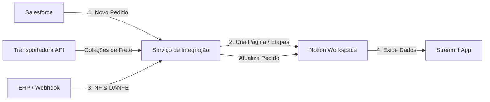

# 🔄 Automação de Fluxo de Trabalho & Integrações (Salesforce • Notion • ERP)

Solução de automação e integração de fluxos de trabalho operacionais, conectando **Salesforce**, **Notion**, **ERP** e **APIs de Logística/Transportadoras**. O projeto automatiza desde a captura de novos pedidos de venda até o faturamento fiscal e expedição, eliminando processos manuais repetitivos.

---

## 🎯 Objetivos do Projeto

* **Eliminar tarefas manuais:** Criação automática de páginas de gestão, definição de etapas e atribuição de responsáveis no Notion.
* **Desacoplamento de sistemas:** Atuação como ponte entre Salesforce e ERP através do Notion, dispensando a necessidade de uma integração nativa direta de alto custo entre as duas plataformas.
* **Visibilidade centralizada:** Dashboard em Streamlit para acompanhamento em tempo real das operações do setor de expedição.
* **Acurácia fiscal e logística:** Atualização automática de NFs, anexação de DANFE e cotação automatizada de frete via API.

---

## ⚙️ Fluxo Principal de Automação

1. **Captura de Pedido:** Identificação de novos pedidos emitidos por representantes comerciais no Salesforce.
2. **Processamento de Dados:** Extração dos dados do cliente e relação de produtos, identificando quais itens demandam encomenda junto à fábrica.
3. **Gestão no Notion:** Criação automática da página do pedido no espaço de trabalho da equipe no Notion, estruturando o fluxo de trabalho e atribuindo os respectivos responsáveis.

---

## 🚀 Funcionalidades & Integrações

### 🧾 Integração com o ERP & Faturamento via Webhooks

* **Registro para Faturamento:** O sistema cadastra cada pedido no ERP observando os produtos que o compõem, viabilizando a operação sem depender de integração nativa Salesforce ↔ ERP.
* **Disparo de Webhook pós-Faturamento:**
* Quando a **Nota Fiscal (NF)** é autorizada no ERP, um *webhook* atualiza automaticamente o pedido no Notion e no Salesforce.
* O arquivo **DANFE (PDF)** é vinculado diretamente ao registro no Notion, ficando disponível para consulta do setor financeiro, representante e cliente.

### 🚚 Cotação Automatizada de Frete

* Consumo da **API da Transportadora Braspress** para cálculo e alimentação de fretes em tempo real.
* Aplicação das regras de negócio e políticas internas de frete da empresa no momento do processamento.

### 📊 Painel de Expedição (Streamlit)

* Aplicação web desenvolvida em **Streamlit** direcionada ao setor de expedição.
* Consumo direto da **API do Notion** para exibição de *DataFrames* interativos, filtrados por critérios específicos de acompanhamento e prioridade dos pedidos.

---

## 🔮 Próximos Objetivos & Roadmap

* [x]  **Refatoração para Arquitetura Orientada a Objetos (POO):**
* [x]  Modelagem e implementação da classe `Cliente`.
* [x]  Modelagem e implementação da classe `Pedido`.
* [ ]  Encapsulamento das regras de integração e comunicação com APIs dentro de módulos e classes dedicadas.
* [ ]  Implementação de interface gráfica

---

## 🛠️ Tecnologias Utilizadas

* **Linguagem:** Python
* **Interface / Data Visualization:** Streamlit, Pandas
* **Plataformas & APIs Integradas:**
* Notion API
* Salesforce API
* REST API / Webhooks do ERP
* API da Transportadora Parceira

* **Arquitetura & Protocolos:** Webhooks, REST, JSON
